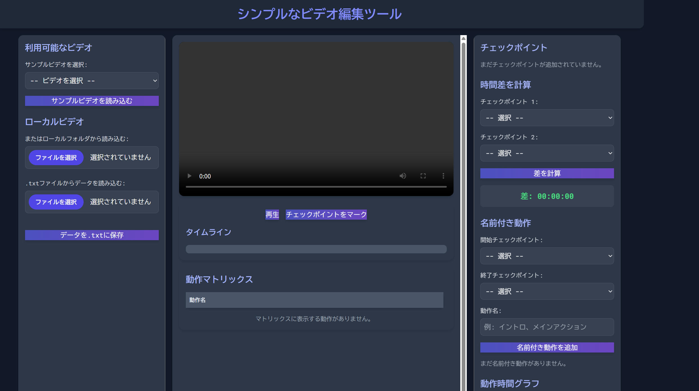

# シンプルなビデオ編集ツール UIコンセプト

  

このリポジトリは、**レスポンシブレイアウト**と**Resizable機能**を備えた、ビデオ編集アプリケーションの**フロントエンドUIコンセプト**をデモンストレーションするために作成された単一のHTMLファイルです。

---

## 🔹 プロジェクト概要

- フロントエンド技術のみで構築（**HTML, Tailwind CSS, JavaScript, jQuery, jQuery UI**）  
- 現代的な**ダークテーマデザイン**  
- ユーザーが自由に**パネルサイズを変更可能**  
- **バックエンド処理や実際のビデオ編集機能は未実装**  
- モダンWebベースの編集ツールの**プロトタイプ**として機能

---

## 🔹 主な技術スタック

| 技術 | 目的 |
|------|------|
| HTML5 | 基本構造の作成 |
| Tailwind CSS | スタイリングとレスポンシブデザイン |
| jQuery / jQuery UI | Resizable（パネルサイズ変更）機能の実装 |
| 日本語 | UI全体のテキストを日本語化 |

---

## 🔹 デモサイト

実際の動作は以下のデモサイトで確認可能です。

🔗 [デモサイトはこちら](https://rikiza.pythonanywhere.com/video-editor-jp/)

---

## 🔹 使い方

1. このリポジトリをクローンまたはHTMLファイルをダウンロード:
   ```bash
   git clone https://github.com/Rikiza89/Video-Editor.git
